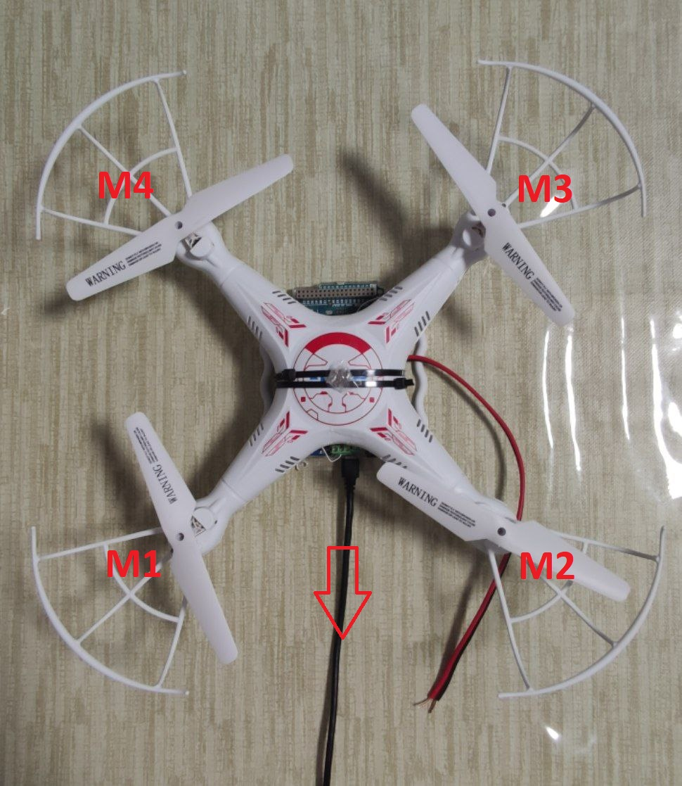
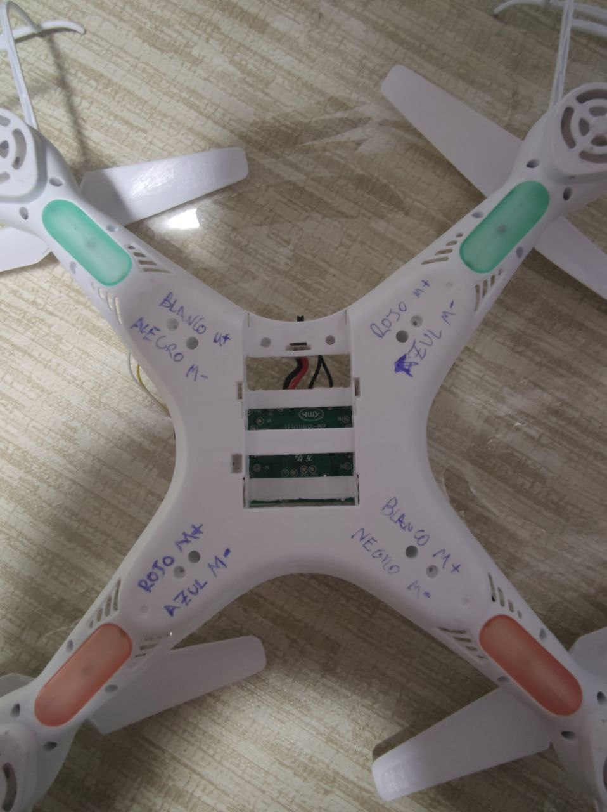

# Prototipo Drone Rotula (PDR)

Existe un prototipo de una rótula con 3 grados de libertad. En la parte superior de su base, se ha sujetado un drone de juguete con motores de corriente continua (DC) utilizando bridas atadas a las patas del drone. El drone se alimenta con una pila de litio de una celda de 3.7V. Para controlar el drone, se utiliza un mando de radiocontrol y se obtiene feedback del ángulo de ataque del drone a través de tres potenciómetros.

Con el fin de realizar el control, se ha modificado el drone como una prueba de concepto para unas prácticas de laboratorio. Se abrió el drone, se cortaron los cables que iban directamente a los motores y se conectaron a la placa de Adafruit Motor/Stepper/Servo Shield V2 para Arduino, que a su vez está conectada a un Arduino Due. Utilizando un programa realizado en Simulink, se pretende realizar un control básico de orientación utilizando 3 controladores PID para demostrar la funcionalidad del prototipo. Para poder usar la placa de Adafruit Motor Shield V2 se ha realizado un driver para Simulink.

La imagen muestra las etiquetas M1, M2, M3 y M4, que hacen referencia a las salidas de la Adafruit Motor Shield V2 a las que están conectados cada motor. En el driver de Simulink, las etiquetas M1, M2, M3 y M4 se denominan U1, U2, U3 y U4, respectivamente. La acción aplicable a cada motor va desde [-4096, 4096], aunque los motores están correctamente conectados para que los valores esperados se encuentren en el rango [0, 4096] y las hélices giren en la dirección correcta. El tipo de dato de las entradas U es int16.

## Primeros resultados: El driver solo puede proporcionar 1.2A por canal, es decir, por motor, con esto el drone no tiene suficiente potencia para moverse. Además, las fuentes que disponemos son limitadas en potencia y no pueden proporcionar 5A sin saltar la protección, ya que aproximadamente necesitariamos unos 10A para mover correctamente el drone. Por tanto, hay que cambiar de elementos hardware.

## Enlaces
- https://www.adafruit.com/product/1438

## Información adicional

Hace refencia a los colores de los cables junto con el conexiado con la placa original.

